<!-- BANNER -->
<p align="center">
  
</p>

<!-- TYPING HEADLINE -->
<p align="center">
  <a href="https://github.com/hectorcanaimero">
    
  </a>
</p>

<!-- BADGES -->
<p align="center">
  <a href="https://github.com/hectorcanaimero?tab=followers">
    
  </a>
  <a href="https://github.com/hectorcanaimero?tab=repositories">
    
  </a>
  <a href="https://github.com/hectorcanaimero?tab=achievements">
    
  </a>
  
</p>

---

## 🌎 ES — Sobre mí

```ts
const hector = {
  role: "Full-Stack Engineer & SaaS Founder",
  location: "🇧🇷 Brasil · 🇻🇪 Venezuela",
  company: "Clube Condor (Supermercados SC/PR)",
  building: ["PideAI", "UseBot", "Condor-martech"],
  stack: {
    frontend: ["Next.js", "React", "React Native", "Flutter", "Angular"],
    backend: ["NestJS", "Supabase", "Node.js", "PostgreSQL"],
    ai: ["Claude API", "OpenAI", "Replicate", "Vector DBs"],
    infra: ["Docker Swarm", "Coolify", "Hetzner", "Traefik"]
  },
  languages: ["🇪🇸 Español", "🇧🇷 Português", "🇺🇸 English"],
  focus: "Construir herramientas de IA para retail y PyMEs en LATAM"
};
```

## 🌎 EN — About me

I'm a full-stack engineer based in Brazil, building products at the intersection of **AI, retail, and Latin American SMBs**. By day I work on **Clube Condor** (a supermarket chain in Santa Catarina/Paraná). After hours, I run two SaaS products and lead the **Condor-martech** marketing technology stack.

My focus: **shipping fast**, automating real-world workflows, and building tools that work for Spanish & Portuguese-speaking markets that big tech often overlooks.

---

## 🚀 Featured Projects

<table>
  <tr>
    <td width="50%" valign="top">
      <h3>🍽️ <a href="https://pideai.com">PideAI</a></h3>
      <p><strong>WhatsApp-based digital menu & ordering for LATAM SMBs</strong></p>
      <p>Sistema de menú digital y pedidos por WhatsApp dirigido a pequeñas empresas en Latinoamérica. Image enhancement con IA, gestión multi-store y un dashboard completo.</p>
      <p>
        
        
        
        
      </p>
    </td>
    <td width="50%" valign="top">
      <h3>🤖 <a href="#">UseBot</a></h3>
      <p><strong>No-code Google Docs → Chatbot builder</strong></p>
      <p>Constructor de chatbots no-code que convierte un Google Doc en un asistente conversacional listo para producción. Cero infra, cero código.</p>
      <p>
        
        
        
        
      </p>
    </td>
  </tr>
  <tr>
    <td width="50%" valign="top">
      <h3>🛒 <a href="https://github.com/Condor-martech">Condor-martech</a></h3>
      <p><strong>Marketing technology stack — Clube Condor</strong></p>
      <p>Organización de proyectos martech para Clube Condor: integraciones Emarsys, automatización de campañas, generación de videos promocionales, y data sync para 30+ tiendas en SC/PR.</p>
      <p>
        
        
        
        
      </p>
    </td>
    <td width="50%" valign="top">
      <h3>🎬 <a href="#">VideoFlow</a></h3>
      <p><strong>Bulk promo video generation for retail chains</strong></p>
      <p>SaaS B2B para generación masiva de videos promocionales con Remotion auto-hospedado, BullMQ + Redis, y deploy en Docker Swarm sobre Hetzner.</p>
      <p>
        
        
        
        
      </p>
    </td>
  </tr>
</table>

---

## 🛠️ Tech Stack

<details open>
<summary><strong>Frontend</strong></summary>
<br/>
<p>
  
  
  
  
  
  
  
</p>
</details>

<details open>
<summary><strong>Backend & Infra</strong></summary>
<br/>
<p>
  
  
  
  
  
  
  
  
</p>
</details>

<details open>
<summary><strong>AI & Automation</strong></summary>
<br/>
<p>
  
  
  
  
  
  
</p>
</details>

---

## 📊 GitHub Stats

<p align="center">
  <a href="https://github.com/hectorcanaimero">
    
  </a>
  <a href="https://github.com/hectorcanaimero">
    
  </a>
</p>

<p align="center">
  <a href="https://github.com/hectorcanaimero">
    
  </a>
</p>

<p align="center">
  
</p>

<p align="center">
  
</p>

---

## 💡 Currently working on

- 🏪 **WebView Loyalty SDK** — React Native rewards SDK for retail apps (Coolify + Supabase + QR validation)
- 🎯 **ContentOS / Marketing OS** — Multi-agent AI marketing automation (Orchestrator → Brand → Writer → Visual → QA → Publisher)
- 📱 **Pelando** — BeReal-style food sharing app for the Venezuelan diaspora (exploring Convex)
- 📈 **Yenny Trade** — Fade-the-pump short-selling bot on Binance Futures (Python · ccxt · Supabase)

---

## 🌐 Connect

<p align="center">
  <a href="https://github.com/hectorcanaimero">
    
  </a>
  <a href="http://canaimeando.github.com">
    
  </a>
  <a href="https://pideai.com">
    
  </a>
</p>

<p align="center">
  <i>"Built in LATAM, for LATAM." 🌎</i>
</p>

<!--
Repo trick: this README lives at github.com/hectorcanaimero/hectorcanaimero
Special repo where the name matches the username — GitHub auto-renders this on your profile.
-->
